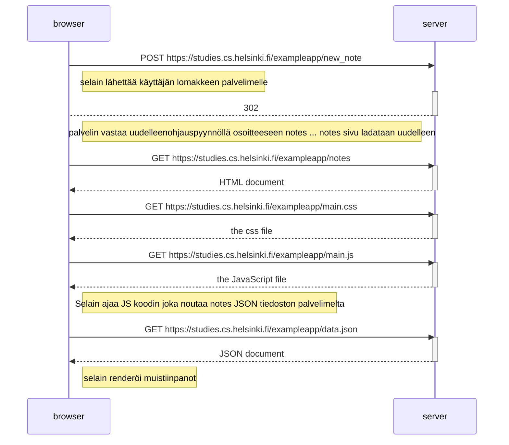

```mermaid
sequenceDiagram
    participant browser
    participant server

    browser->>server: POST https://studies.cs.helsinki.fi/exampleapp/new_note
    Note right of browser: selain lähettää käyttäjän lomakkeen palvelimelle
    activate server
    server-->browser: 302
    deactivate server

    Note right of browser: palvelin vastaa uudelleenohjauspyynnöllä osoitteeseen notes ... notes sivu ladataan uudelleen
    
    browser->>server: GET https://studies.cs.helsinki.fi/exampleapp/notes
    activate server
    server-->>browser: HTML document
    deactivate server
    
    browser->>server: GET https://studies.cs.helsinki.fi/exampleapp/main.css
    activate server
    server-->>browser: the css file
    deactivate server

    browser->>server: GET https://studies.cs.helsinki.fi/exampleapp/main.js
    activate server
    server-->>browser: the JavaScript file
    deactivate server
    
    Note right of browser: Selain ajaa JS koodin joka noutaa notes JSON tiedoston palvelimelta
    
    browser->>server: GET https://studies.cs.helsinki.fi/exampleapp/data.json
    activate server
    server-->>browser: JSON document
    deactivate server    

    Note right of browser: selain renderöi muistiinpanot
```

